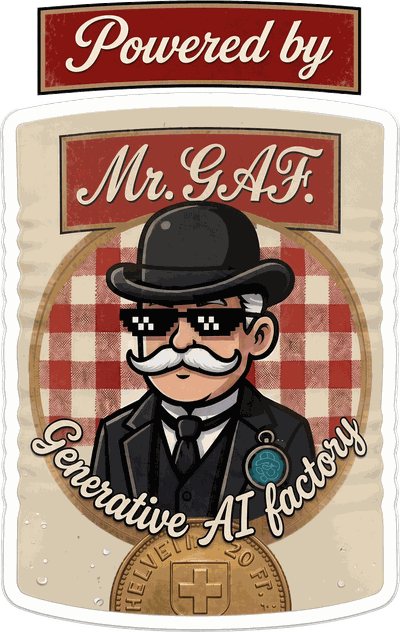

# 🎩 GAF — Generative AI Factory

**GAF is a pattern; a Factory is one installation of it.** It turns a software
project into one that improves itself: the community proposes ideas, votes on
them, and independently scheduled AI roles review, build, and ship the winners
— each decision documented in public, the whole pipeline steered by one
owner-controlled rulebook. Voting is optional — the base pipeline simply
triages ideas in order, and a solo private install is a first-class shape.

This repository is the **installable skill** that sets a Factory up in any
project: a game, a SaaS product, a website builder, an internal tool.

## Provenance

This is not speculative documentation. It was reverse-standardized from
two live installations: a browser game (community web board, voting,
email, auto-deploy) whose ideas shipped with no human in the loop, and a
private iOS app (solo owner, tracker-direct, no voting, CI compile gate
because the agent cannot build iOS locally) — which also stress-tested
the pipeline through a real platform outage on day one. Every design rule
here exists because of a real success or a real failure in one of them.

## What's in here

| Path | What it is |
| ---- | ---------- |
| [`SKILL.md`](./SKILL.md) | **Start here.** The setup protocol — 6 phases, every step tagged `[AGENT]`, `[OPERATOR]`, or `[TOGETHER]`. |
| [`references/BLUEPRINT.md`](./references/BLUEPRINT.md) | The invariant pattern: data model, label grammar, meta block, web-layer contract, and the design rules that keep a Factory alive unattended. |
| [`references/ROLES.md`](./references/ROLES.md) | The six-clause role contract, the default Architect → Coder pipeline, and recipes for extending it (Tester, Deployer). |
| [`references/OWNER_WORKBOOK.md`](./references/OWNER_WORKBOOK.md) | The guided owner interview — 12 decisions, each explained and illustrated across four domains before it's asked. |
| [`references/OPERATOR_GUIDE.md`](./references/OPERATOR_GUIDE.md) | The human-only steps — conditional on the chosen shape — with the token decision table, CI costs, and the traps that were hit for real. |
| [`references/RUNNERS.md`](./references/RUNNERS.md) | **Exact click-path walkthroughs per runner** (Claude Routines, `/loop`, Actions cron), each runner's trap, and where secrets live. |
| [`references/ADAPTATION.md`](./references/ADAPTATION.md) | Named swap points: issue tracker, deploy target, email provider, runner, and the hobby → business → regulated posture ladder. |
| [`templates/`](./templates) | Fill-in templates for every generated file, plus the default label set as JSON. |
| [`WEAKNESSES.md`](./WEAKNESSES.md) | Known limitations of the pattern (K1–K10), deliberately deferred. Read before installing; revisit as a Factory grows. |
| [`CONTRIBUTING.md`](./CONTRIBUTING.md) | How to propose a change — and why every rule here has to come with the story of the install that earned it. |

## Installing it in a project

One command, from the target project's root:

```bash
npx skills add inofc/gaf
```

It installs the `gaf-setup` skill for Claude Code and other agents
(Cursor, Codex, Cline, …) and can update it later (`npx skills update`).

<details>
<summary>Manual install (no npx)</summary>

Copy this repository's contents into the target project as a skill:

```bash
mkdir -p .claude/skills/gaf-setup
# copy this repo's files into that folder (git clone, or cp from a local checkout)
```

The folder must be named **`gaf-setup`** to match the `name:` in `SKILL.md`'s
frontmatter.

</details>

Then, in a session on that project:

> *"Set up a GAF in this project — read `.claude/skills/gaf-setup/SKILL.md`
> and follow it."*

Setup opens with a **wizard briefing**: before anything runs, the agent
lays out all phases in plain words — what happens after what, which parts
are yours, roughly how long each takes — and asks one shaping question
(Minimal vs Community) that prunes everything that follows.

## What setup actually requires

A Factory cannot be installed by an AI alone, by design. The agent handles
discovery, file generation, and the smoke test; **a human owner is required**
for two things no automation should decide:

- **The Owner's Workbook session** (~30–45 min) — what the product is, what
  may never be broken, what "shipped" means, how fast the roles run. These
  answers become the rulebook that constrains an otherwise unsupervised
  pipeline.
- **Credentials and schedules** — the bot account, its token, the hosting
  secrets, and the schedules that start the Factory.

Have the bot account and its token ready before the session and setup goes
faster; `references/OPERATOR_GUIDE.md` lists exactly what to prepare.

## How it works, in one diagram

```
User submits idea (Ideas Board or issue tracker)
   → Issue            labels: idea, stage:submitted          ── community votes
   → AI Architect     (scheduled; one idea per run)
                        approve → architect:approved + impact:* + coder:queued
                        decline → architect:declined
                        + mandatory "Architect Assessment" comment
   → AI Coder         (separately scheduled; one idea per run)
                        coder:queued → coder:in-process → coder:executed
                        implements on a factory/* branch → PR → ships
                        + mandatory "Implementation Report" comment
   → new version live per the installation's ship definition
   → submitter notified at each stage (optional)
```

Three commitments make it work: **the issue tracker is the entire database**
(labels are the state machine, no hidden state), **role instructions live in
the repo as files** (so behavior changes are file edits, never schedule
rewiring, and any runner or model can execute a role), and **nothing happens
without a public paper trail** (no verdict without an assessment, no ship
without a report, every approved idea in a ledger).

## Powered by GAF — show the badge

<a href="https://github.com/inofc/gaf" title="Powered by GAF — Generative AI Factory">
  
</a>

Does your project run a Factory? Put **Mr. GAF** (above — that's exactly how
the badge renders) on your site or README and link back here, so your users
know who ships their ideas.

**Markdown** (README, docs):

```markdown
[](https://github.com/inofc/gaf)
```

**HTML** (websites — sized for a footer):

```html
<a href="https://github.com/inofc/gaf" title="Powered by GAF — Generative AI Factory">
  
</a>
```

**Text-only badge** (when an image doesn't fit):

```markdown
[](https://github.com/inofc/gaf)
```

## License

Licensed under the [Apache License 2.0](./LICENSE) — use it, install it in
commercial projects, adapt it. If you build something with it, saying so is
appreciated but not required.

## Contributing

Bug reports about the pattern, new runner walkthroughs, and adaptation notes
from your own installation are all welcome — see
[`CONTRIBUTING.md`](./CONTRIBUTING.md). The one thing this repo asks: rules
come from real installations, not from speculation.
